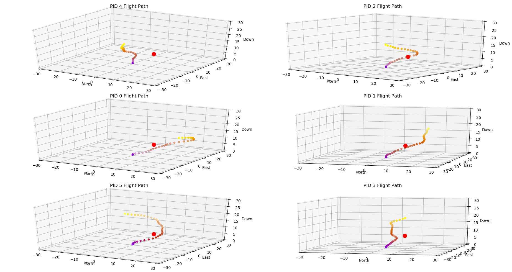

# GannFlight
Genetic Neural Network Control Framework for ArduCopter (Multi-Instance SITL)

## Overview

GannFlight is a research framework for launching and coordinating multiple ArduCopter SITL (Software-In-The-Loop) instances during controller experiments.

This repository now includes two command-line scripts designed to work together:

- `controller.py`: runs on the machine that has ArduPilot installed and manages SITL processes.
- `client.py`: sends start/stop/list commands to `controller.py` over TCP.

---

## Repository Organization

- `controller.py` - TCP server that starts/stops SITL instances.
- `client.py` - CLI client for controlling instances remotely or locally.
- `main/simulation_controller.py` - backward-compatible entrypoint that forwards to `controller.py`.
- `main/client.ipynb` - notebook used for experimentation/training workflows.
- `images/` - plots and output images from simulation/training runs.

---

## Requirements

- Linux (tested on Ubuntu)
- Python 3.10+
- ArduPilot source checkout (default expected path: `/home/robotics/ardupilot`)

Recommended: create and use a Python virtual environment for your experiment tooling.

---

## Script Reference

## `controller.py`

Starts a TCP server and accepts these commands:

- `start <instance_id> <out_port>`
- `stop <instance_id>`
- `list`
- `stop-all`

### Controller options

```bash
python3 controller.py --help
```

Important arguments:

- `--host` (default `0.0.0.0`): interface to bind for incoming client connections.
- `--port` (default `14500`): TCP port for control commands.
- `--ardupilot-path` (default `/home/robotics/ardupilot`): local ArduPilot checkout path.
- `--out-host` (default `127.0.0.1`): destination host for SITL MAVLink `--out` stream.

## `client.py`

Sends one command per invocation.

```bash
python3 client.py --help
```

Subcommands:

- `start <instance_id> <out_port>`
- `stop <instance_id>`
- `list`
- `stop-all`
- `raw "<command>"`

---

## Usage: Single Machine

This mode is for when **controller + client + MAVLink consumer** all run on one computer.

### 1) Start the controller

```bash
python3 controller.py \
  --host 0.0.0.0 \
  --port 14500 \
  --ardupilot-path /home/robotics/ardupilot \
  --out-host 127.0.0.1
```

### 2) Start one or more SITL instances from another terminal

```bash
python3 client.py --host 127.0.0.1 --port 14500 start 0 14550
python3 client.py --host 127.0.0.1 --port 14500 start 1 14551
python3 client.py --host 127.0.0.1 --port 14500 list
```

### 3) Connect your MAVLink consumer

For instance `0` started with `out_port=14550`, connect your consumer to UDP port `14550` on the same machine (example pymavlink endpoint: `udpin:0.0.0.0:14550`).

### 4) Stop instances

```bash
python3 client.py --host 127.0.0.1 --port 14500 stop 0
python3 client.py --host 127.0.0.1 --port 14500 stop-all
```

---

## Usage: Multiple Machines

This mode is for when SITL runs on one machine and your experiment/training code runs on another.

### Topology

- **Machine A (simulation host)**: runs `controller.py` and ArduPilot SITL.
- **Machine B (experiment host)**: runs `client.py` and your training/analysis code.

Assume:

- Machine A IP: `192.168.1.124`
- Machine B IP: `192.168.1.40`
- Control port: `14500`

### 1) On Machine A, start controller with `--out-host` set to Machine B

```bash
python3 controller.py \
  --host 0.0.0.0 \
  --port 14500 \
  --ardupilot-path /home/robotics/ardupilot \
  --out-host 192.168.1.40
```

This ensures each SITL instance is launched with `--out 192.168.1.40:<out_port>`.

### 2) On Machine B, send commands to Machine A

```bash
python3 client.py --host 192.168.1.124 --port 14500 start 0 14550
python3 client.py --host 192.168.1.124 --port 14500 start 1 14551
python3 client.py --host 192.168.1.124 --port 14500 list
```

### 3) On Machine B, listen on those UDP ports

Your consumer/training loop should bind to each configured `out_port` (for example `14550`, `14551`).

### 4) Networking checklist

- Open TCP `14500` from Machine B to Machine A.
- Open UDP `14550+` (or your chosen range) to Machine B.
- Ensure no local firewall blocks these ports.
- Verify routing between subnets/VLANs if machines are not on the same LAN.

### 5) Shutdown

```bash
python3 client.py --host 192.168.1.124 --port 14500 stop-all
```

---

## Notes

- Instance IDs should be unique per controller process.
- Keep `out_port` unique per instance to avoid UDP conflicts.
- Use `list` to inspect currently managed instances.
- Use `main/simulation_controller.py` only if older automation still points to that path.

---

## Example Output


